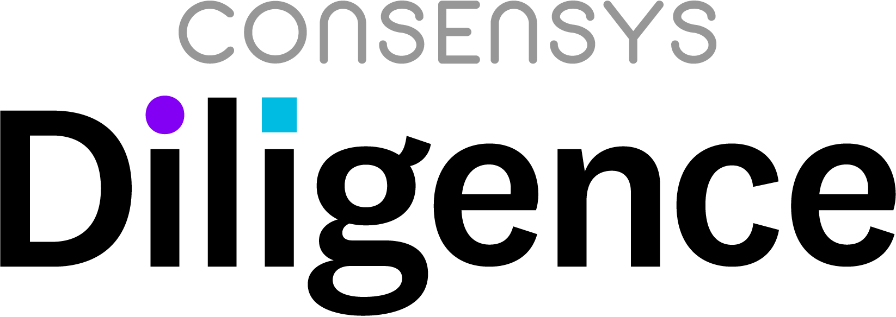

# ConsenSys Diligence Compilation

## Table of Contents
- [ConsenSys Diligence Compilation](#consensys-diligence-compilation)
  * [Presentations](#presentations)
  * [Papers](#papers)
  * [Audits](#audits)
  * [Panels and Workshops](#panels-and-workshops)

-----------

## Presentations

| Title | Links | Venue | Speaker | Date |
| -------- | -------- | -------- | ------- | ------- |
| Smart Contract Secure SDLC | [Video](https://www.youtube.com/watch?v=5bXWnDuIYQs) | [Hi-Con](https://conference.hi-ether.org/) | Tom Lindeman | November 2018 |
| Solidity Dapp Optimization | [Video](https://www.youtube.com/watch?v=qwBkeJ84d2g) | [DAPPCON](https://dappcon.io/) | Gonçalo Sá | July 2018 |
| Smart contract vulnerabilities | [Video](https://www.youtube.com/watch?v=vfQ7z521APg) | [NorthSec](https://nsec.io/) | Sarah Friend & Jon Maurelian | May 2018 |
| Smashing Ethereum Smart Contracts for Fun and ACTUAL Profit | [Paper](https://conference.hitb.org/hitbsecconf2018ams/materials/D1T2%20-%20Bernhard%20Mueller%20-%20Smashing%20Ethereum%20Smart%20Contracts%20for%20Fun%20and%20ACTUAL%20Profit.pdf), [Video](https://www.youtube.com/watch?v=iqf6epACgds) | [HITB Security Conference](https://conference.hitb.org/hitbsecconf2018ams/) | Bernhard Mueller | April 2018 |
| A brief history of smart contract security | [Video](https://www.youtube.com/watch?v=8LAThtT7euA) | [Empire Hacking](https://blog.trailofbits.com/2017/12/22/videos-from-ethereum-focused-empire-hacking/) | Jon Maurelian | December 2017 |
| BTC Relay | [Video](https://www.youtube.com/watch?v=5WGgoVmfIik) | DEVCON 1 | Joseph Chow | November 2015 |

## Papers

| Title | Venue | Author(s)  | Date |
| -------- | -------- | -------- | -------- |
| [Smashing Ethereum Smart Contracts for Fun and Real Profit](Papers/D1T2%20-%20Bernhard%20Mueller%20-%20Smashing%20Ethereum%20Smart%20Contracts%20for%20Fun%20and%20ACTUAL%20Profit.pdf) | [HITB Security Conference](https://conference.hitb.org/hitbsecconf2018ams/) | Bernhard Mueller    |  April 2018  |

## Audits

| Title | Links | Date |
| -------- | -------- | -------- |
| [0x](https://0x.org/) ([MultiAssetProxy](https://github.com/0xProject/0x-protocol-specification/blob/ad13141d9a2c6d93e06658d18c53e9f3d99442d4/v2/v2-specification.md#multiassetproxy)) | [Report](https://github.com/ConsenSys/0x-audit-report-2018-12) | December 2018 |
| [Aragon](https://aragon.org/) | [Report](https://github.com/ConsenSys/aragon_audit_report_2018-06-04_extended/blob/master/Aragon-Audit-final.md), [Announcement](https://blog.aragon.org/releasing-aragonos-4/) | November 2018 |
| [0x](https://0x.org/) ([Version 2](https://github.com/0xProject/0x-protocol-specification/blob/master/v2/v2-specification.md)) | [Report](https://github.com/ConsenSys/0x_audit_report_2018-07-23), [Announcement](https://media.consensys.net/auditing-the-0x-protocol-v2-with-consensys-diligence-a52995407730) | September 2018  |
| [Brickblock](https://www.brickblock.io/) | [Report](https://github.com/brickblock-io/smart-contracts/blob/master/docs/audits/2018-09-20%20-%20Full%20Ecosystem%20%5BPhase%202%5D%20-%20Audit%20by%20ConsenSys%20final.pdf), [Announcement](https://blog.brickblock.io/consensys-diligence-delivers-final-audit-report-on-brickblock-smart-contract-ecosystem-c8a521b64d8e) | September 2018 |
| [Simple-multisig](https://github.com/christianlundkvist/simple-multisig) | [Report](Audits/SimpleMultisigWallet_Audit.pdf) | September 2018 |
| [Meridio](https://www.meridio.co/) | [Announcement](https://medium.com/meridio/meridio-partners-with-airswap-to-integrate-tools-for-secondary-trading-ebafcf3240ea) | September 2018 |
| [FOAM](https://foam.space/) | [Report](https://github.com/f-o-a-m/public-research/blob/master/foam-controller-audit-report-2018-08-24-master.pdf), [Announcement](https://twitter.com/foamspace/status/1038114569003167745) | August 2018 |
|[CENTRE](https://www.centre.io/index.html) USDC token | [Announcement](https://medium.com/centre-blog/designing-an-upgradeable-ethereum-contract-3d850f637794) | August 2018 |
| [Modular](https://github.com/Modular-Network) ([Interactive Coin Offerings](https://people.cs.uchicago.edu/~teutsch/papers/ico.pdf)) | [Report](https://github.com/ConsenSys/Interactive-Crowdsale-Audit), [Announcement](https://media.consensys.net/interactive-crowdsale-iico-audit-5307e4d3b897)| July 2018 |
| TCR ([Token-Curated Registry](https://github.com/skmgoldin/tcr)) | [Report](https://github.com/ConsenSys/tcr-audit/blob/master/README.pdf) | April 2018 |
| [Imbrex](https://imbrex.io/) | [Report](https://drive.google.com/file/d/1KCFBTMK5dQeqxzmOsjs-fxeLmi7P12F1/view), [Announcement](https://about.imbrex.io/blog/consensys-diligence-audit-summary/) | March 2018  |
| [0x](https://0x.org/) | [Report](https://github.com/ConsenSys/0x-review), [Announcement](https://blog.0xproject.com/bug-bounty-instructions-adcec1144e36) | August 2017 |
| [uPort](https://www.uport.me/) | [Report](https://github.com/ConsenSys/uport-audit) | April 2017  |

## Panels and Workshops

| Title | Links | Venue  | Date |
| -------- | -------- | -------- | ------- |
| Current State of Security Panel | [Video](https://www.youtube.com/watch?v=xYhf3jrQg00) | [DevCon IV](https://devcon4.ethereum.org/) | November 2018 |
